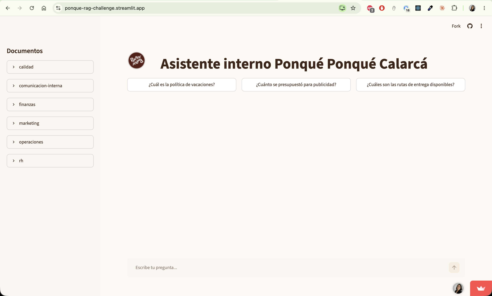
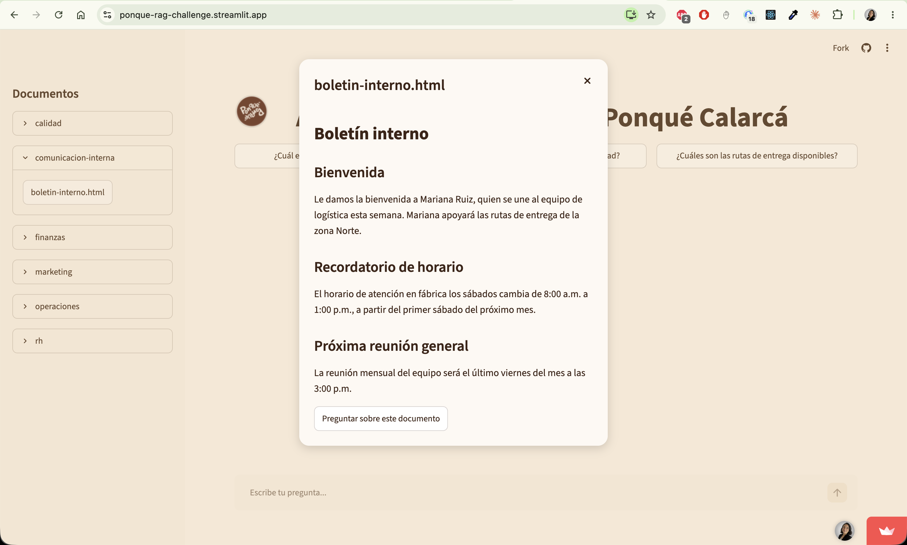

# Asistente interno Ponqué Ponqué Calarcá (RAG) — Challenge Oracle ONE

**Ponqué Ponqué Calarcá** es la distribuidora exclusiva de la marca de tortas artesanales
**Ponqué Ponqué**. El negocio está en etapa de lanzamiento y vende a gimnasios, cafés y consumidores finales.
Este repositorio es el agente de inteligencia artificial interno del negocio: responde preguntas
de los colaboradores sobre sus propios documentos (políticas, procesos, finanzas, etc.) y es
el entregable del challenge del bootcamp Oracle ONE (Alura), construido como un agente
conversacional tipo RAG (Retrieval Augmented Generation).

> Los documentos indexados (`documentos/`) son **ficticios**, creados solo para este
> ejercicio. No contienen información real del negocio.

## URL pública

**[ponque-rag-challenge.streamlit.app](https://ponque-rag-challenge.streamlit.app)**

## Qué hace

- Ingesta multi-formato: PDF, Word, Excel, PowerPoint, Markdown, CSV, JSON y HTML.
- Cobertura multi-área: operaciones/logística, finanzas, marketing, RH, calidad y
  comunicación interna.
- Acceso abierto: cualquier colaborador puede preguntar sobre cualquier documento, sin
  restricción por rol ni departamento.
- Cada respuesta cita el/los documento(s) fuente que la respaldan.
- Panel de documentos: barra lateral con los documentos agrupados por área, con vista
  previa de cada uno.
- Preguntas rápidas: píldoras con preguntas de ejemplo para probar el asistente sin escribir.

## Arquitectura

- **Interfaz:** [Streamlit](https://streamlit.io) (`streamlit_app.py`).
- **Embeddings:** 100% locales con [fastembed](https://github.com/qdrant/fastembed)
  (`app/streamlit_rag.py`, modelo multilingüe, sin API ni costo) e índice en memoria
  (recalculado al arrancar, sin base de datos persistida).
- **Chat:** API gratuita de [Groq](https://groq.com) (`app/llm_groq.py`).
- **Ingesta:** un cargador por formato (`ingesta/cargadores.py`) + troceo con
  `langchain-text-splitters` (`ingesta/chunking.py`).

## Cómo correr en local

```bash
python -m venv .venv && source .venv/bin/activate
pip install -r requirements.txt
echo 'GROQ_API_KEY=tu-api-key-de-console.groq.com' >> .env
streamlit run streamlit_app.py
```

Abre la URL que imprime Streamlit (por defecto `http://localhost:8501`).

## Despliegue en Streamlit Community Cloud

1. Sube el repo a GitHub (ya está público).
2. Entra a [share.streamlit.io](https://share.streamlit.io) → **Create app** →
   **Deploy a public app from GitHub**.
3. Repository: tu repo · Branch: `main` · Main file path: `streamlit_app.py`.
4. En **Advanced settings → Secrets**, agrega:
   ```
   GROQ_API_KEY = "tu-api-key"
   ```
5. **Deploy**. La primera vez tarda un poco más porque `fastembed` descarga el
   modelo de embeddings.

## Pruebas

```bash
python -m unittest discover tests
```

## Evidencia





## Stack

Streamlit · Groq · fastembed
