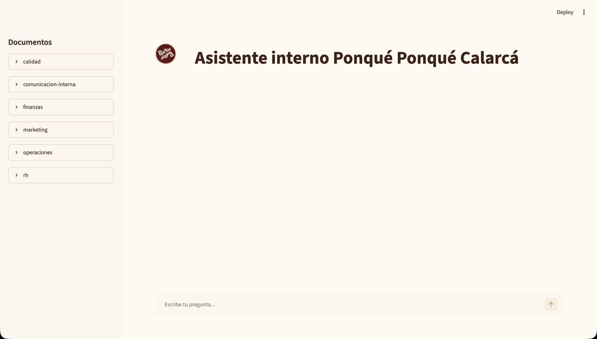
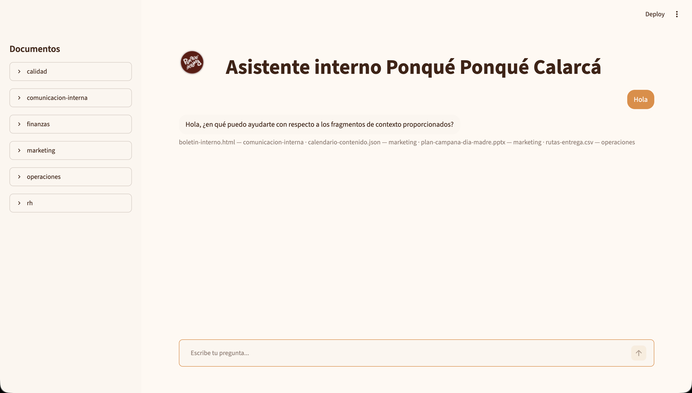

# Asistente interno Ponqué Ponqué Calarcá (RAG) — Challenge Oracle ONE

**Ponqué Ponqué Calarcá** es la distribuidora exclusiva de la marca de tortas artesanales
**Ponqué Ponqué**. El negocio está en etapa de lanzamiento y vende a gimnasios, cafés y consumidores finales.
Este repositorio es el agente de inteligencia artificial interno del negocio: responde preguntas
de los colaboradores sobre sus propios documentos (políticas, procesos, finanzas, etc.) y es
el entregable del challenge del bootcamp Oracle ONE (Alura), construido como un agente
conversacional tipo RAG (Retrieval Augmented Generation).

> Los documentos indexados (`documentos/`) son **ficticios**, creados solo para este
> ejercicio. No contienen información real del negocio.

## URL pública

**[ponque-rag-challenge.streamlit.app](https://ponque-rag-challenge.streamlit.app)**

## Qué hace

- Ingesta multi-formato: PDF, Word, Excel, PowerPoint, Markdown, CSV, JSON y HTML.
- Cobertura multi-área: operaciones/logística, finanzas, marketing, RH, calidad y
  comunicación interna.
- Acceso abierto: cualquier colaborador puede preguntar sobre cualquier documento, sin
  restricción por rol ni departamento.
- Cada respuesta cita el/los documento(s) fuente que la respaldan.
- Panel de documentos: barra lateral con los documentos agrupados por área; al hacer clic
  en uno se abre una vista previa en modal con el contenido formateado y un botón para
  preguntarle directamente al asistente sobre ese documento.

## Arquitectura

Hay dos formas de correr el agente, según dónde se despliegue:

- **Streamlit Cloud (la URL pública de arriba):** interfaz en `streamlit_app.py`.
  Embeddings 100% locales con [fastembed](https://github.com/qdrant/fastembed)
  (`app/streamlit_rag.py`, modelo multilingüe, sin API ni costo) e índice en
  memoria (recalculado al arrancar, sin base de datos persistida). El chat lo
  genera la API gratuita de [Groq](https://groq.com) (`app/llm_groq.py`).
- **FastAPI + Docker (pensado para una VM Compute Always Free de OCI):**
  endpoint `POST /chat` (`app/main.py`), índice vectorial ChromaDB persistido
  en disco (`app/rag_index.py`), y [Ollama](https://ollama.com) local para
  embeddings y generación de respuesta (`app/local_llm.py`) — modelos abiertos
  (`llama3.2:3b` + `nomic-embed-text`) corriendo en la propia VM, sin costo de
  inferencia. Ver "Despliegue en OCI" más abajo.

En ambos casos:

- **Ingesta:** un cargador por formato (`ingesta/cargadores.py`) + troceo con
  `langchain-text-splitters` (`ingesta/chunking.py`).

## Cómo correr en local (Streamlit + Groq)

```bash
python -m venv .venv && source .venv/bin/activate
pip install -r requirements.txt
echo 'GROQ_API_KEY=tu-api-key-de-console.groq.com' >> .env
streamlit run streamlit_app.py
```

Abre la URL que imprime Streamlit (por defecto `http://localhost:8501`).

## Despliegue en Streamlit Community Cloud

1. Sube el repo a GitHub (ya está público).
2. Entra a [share.streamlit.io](https://share.streamlit.io) → **Create app** →
   **Deploy a public app from GitHub**.
3. Repository: tu repo · Branch: `main` · Main file path: `streamlit_app.py`.
4. En **Advanced settings → Secrets**, agrega:
   ```
   GROQ_API_KEY = "tu-api-key"
   ```
5. **Deploy**. La primera vez tarda un poco más porque `fastembed` descarga el
   modelo de embeddings.

## Cómo correr en local (FastAPI + Ollama, alternativa para OCI)

```bash
brew install ollama          # o https://ollama.com/download
ollama serve &                # o `brew services start ollama`
ollama pull llama3.2:3b
ollama pull nomic-embed-text

python -m venv .venv && source .venv/bin/activate
pip install -r requirements.txt
cp .env.example .env
python scripts/indexar_documentos.py
uvicorn app.main:app --reload
```

Abre `http://localhost:8000`.

## Pruebas

```bash
python -m unittest discover tests
```

## Despliegue en OCI (alternativa)

> La URL pública del challenge corre en Streamlit Cloud (ver arriba). Esta
> sección queda documentada como ruta alternativa de despliegue —el código
> funciona— pero el tier Always Free de OCI para instancias ARM Ampere suele
> tener problemas de disponibilidad ("Out of host capacity").

Esta sección describe cómo llevar el contenedor del agente RAG a una VM Compute Always Free en Oracle Cloud. Asume que ya tienes una instancia Ubuntu (ARM Ampere) creada y accesible por SSH.

### Paso 1: Conectarte a la VM

Abre una terminal en tu computador y conectate con tu clave privada:

```bash
ssh -i <tu-clave-privada.pem> ubuntu@<IP-publica-de-la-VM>
```

Reemplaza `<tu-clave-privada.pem>` con la ruta a tu archivo de clave privada y `<IP-publica-de-la-VM>` con la dirección IP pública de tu instancia.

### Paso 2: Instalar Docker en la VM

Una vez conectado por SSH, actualiza el sistema e instala Docker:

```bash
sudo apt update && sudo apt install -y docker.io docker-compose-plugin
sudo usermod -aG docker $USER
```

Después de ejecutar estos comandos, **cierra la sesión SSH y vuelve a conectarte** para que el grupo `docker` tome efecto:

```bash
exit
ssh -i <tu-clave-privada.pem> ubuntu@<IP-publica-de-la-VM>
```

### Paso 3: Clonar el repositorio

El repositorio está público en GitHub. Clónalo en tu VM:

```bash
git clone https://github.com/LinamariaMartinez/ponque-rag-challenge.git
cd ponque-rag-challenge
```

### Paso 4: Copiar `.env` a la VM

Desde tu computador **local** (no desde la VM), copia el archivo `.env`:

```bash
scp -i <tu-clave-privada.pem> .env ubuntu@<IP-publica-de-la-VM>:~/ponque-rag-challenge/.env
```

No hace falta copiar ninguna credencial: el motor de IA es Ollama corriendo dentro de la
propia VM, no un servicio externo.

### Paso 5: Levantar los contenedores en la VM

Conectate nuevamente a la VM y corre Docker Compose:

```bash
ssh -i <tu-clave-privada.pem> ubuntu@<IP-publica-de-la-VM>
cd ponque-rag-challenge
docker compose up -d --build
docker compose logs -f
```

El primer arranque tarda varios minutos: el contenedor `ollama` descarga los modelos
(~2 GB) antes de que el contenedor `agente` pueda indexar los documentos y arrancar.
Espera a que los logs muestren las líneas `[ok]` del indexado y luego
`Uvicorn running on http://0.0.0.0:8000`. Esto indica que el servicio está listo.

### Paso 6: Abrir el puerto 8000 en el firewall

En la consola de Oracle Cloud, navega a la sección de **Redes** y edita el **Security List** (o Network Security Group) de la subred donde está tu VM. Agrega una regla de **ingreso** con los siguientes parámetros:

- **Protocolo:** TCP
- **Puerto de destino:** 8000
- **Origen:** `0.0.0.0/0` (acceso desde cualquier IP)

Guarda la regla.

### Paso 7: Verificar el despliegue

Desde tu computador local, verifica que el servicio está accesible:

```bash
curl -s -X POST http://<IP-publica-de-la-VM>:8000/chat \
  -H "Content-Type: application/json" \
  -d '{"pregunta":"¿Cuál es la política de vacaciones?"}'
```

Deberías recibir un JSON con `"respuesta"` y `"fuentes"`.

También puedes abrir en tu navegador la URL `http://<IP-publica-de-la-VM>:8000` para acceder a la interfaz web del chat.

---

**Nota:** Reemplaza todos los placeholders (`<tu-clave-privada.pem>`, `<IP-publica-de-la-VM>`) con tus valores reales antes de ejecutar cualquier comando.

## Evidencia

App en Streamlit Cloud (la desplegada en la URL pública):





Interfaz FastAPI (versión local/alternativa para OCI):


## Stack

Streamlit · Groq · fastembed · FastAPI · ChromaDB · Ollama · Docker · OCI Compute (Always Free)
